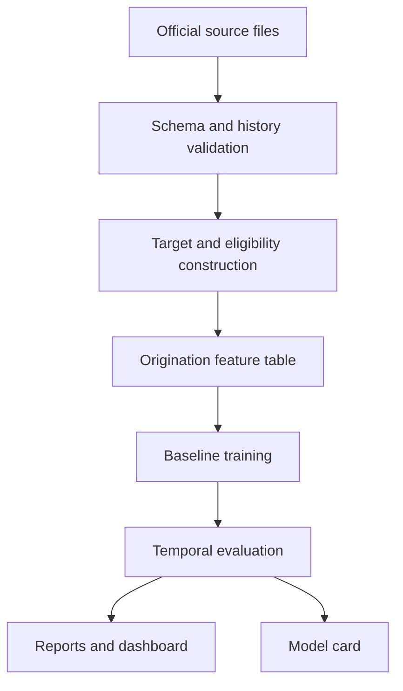

# Architecture and scope

Date: 2026-10-06
Status: target details pending source inspection.

## 1. Research question and users

Can an interpretable model using information available at mortgage origination estimate 12-month serious-delinquency risk and remain well calibrated on later cohorts?

Primary users are credit-risk analysts and model reviewers. Outputs support research, model assessment and portfolio summaries. This release does not automate loan approval.

## 2. Scope and units

V0.1 covers US mortgages from official Freddie Mac sample files. One modeling row represents one loan at origination. Monthly performance rows are used to construct outcomes, not as origination predictors.

Start with a small set of complete origination vintages. Select exact years after verifying historical coverage, schema consistency, event counts and data size. No full historical download is required for the first experiment.

## 3. Target contract

Working event: first observed 90+ days-past-due status within 12 months after the prediction origin. The mapping from reported delinquency codes to this event must be verified against the selected release's dictionary.

Before ingestion is considered complete, document:

- The exact date anchoring prediction and the first and last included performance month. Origination, first payment and acquisition dates must not be treated as interchangeable.
- Whether the history actually covers the required window from origination. Loans with an unobserved initial interval cannot automatically receive a complete label.
- Rules for missing months, unknown delinquency codes, modifications, terminal events and source corrections.
- Treatment of verified full repayment before month 12. Repayment is a competing terminal event, not an observed active loan for the remaining months. Specify its use in the fixed-horizon estimand and show its frequency.
- Treatment of foreclosure and other exits without observed 90+ delinquency; these cannot silently be labeled good.

Labels must distinguish event, complete event-free follow-up, verified early repayment, and unresolved/incomplete follow-up. An incomplete loan without an observed event is not a negative label. Publish the population waterfall and excluded-record counts.

The 90+ event is a proposed research definition, subject to validation; it does not establish IFRS 9 or regulatory default equivalence.

## 4. Predictor availability

Use only verified origination-time attributes. Candidate fields include credit score, LTV, DTI, original balance, term and loan purpose, subject to dictionary and availability review.

Exclude monthly future balances, future delinquency, liquidation information and other outcome-derived fields. Audit whether each origination-file field was known at the proposed prediction date or recorded later; file membership alone does not establish availability.

Fit imputers, category mappings, scaling and feature selection using training data only. Apply the fitted pipeline unchanged to validation and test cohorts.

## 5. Data flow and boundaries

| Location | Responsibility |
| --- | --- |
| src/cosmic_credit/data | File ingestion, schema validation, history and target construction |
| src/cosmic_credit/features | Availability audit and fitted preprocessing |
| src/cosmic_credit/models | Prevalence benchmark and logistic regression |
| src/cosmic_credit/evaluation | Temporal splits, discrimination, calibration and uncertainty |
| src/cosmic_credit/monitoring | Later cohort summaries and drift diagnostics |
| src/cosmic_credit/dashboards | Read-only presentation of generated results |
| configs | Cohorts, source release, target rules and experiment settings |
| reports | Aggregate metrics, figures and model cards |
| notebooks | Exploration and presentation; authoritative logic remains in src |

Implement only the modules required by the current increment. The first modeling path is batch processing; an API, containers, orchestration and an agent require a concrete later use case.

## 6. Reproducibility

Keep raw files unchanged and outside Git. Record source release, acquisition date, file hashes, schema version, sampling choices, exclusions, cohort boundaries, seed, configuration and code revision.

A source refresh creates a new versioned experiment input. Do not silently overwrite the dataset behind published results. Record actual environment and dependency versions with experiments.

## 7. Baselines and evaluation

Benchmark 0 assigns the training event prevalence to every eligible loan. Benchmark 1 is regularized logistic regression with documented preprocessing. A future challenger is optional.

Split by origination time into training, validation and a final held-out later cohort. At each simulated training cutoff, include only labels that would have been available then; leave a sufficient gap for the target window and reporting lag. Exact dates will be selected after data inspection. No loan may cross partitions.

Use validation for tuning and optional calibration; keep the test cohort untouched until the specification is frozen. Evaluate ROC AUC and PR AUC for discrimination, Brier score and log loss for probability quality, and calibration plots with event counts. Report prevalence, sample size and results by cohort. Estimate uncertainty by resampling loans, preserving within-loan dependence if later analyses use multiple rows.

The constant benchmark and logistic model must be evaluated on the same population. Set primary metrics, practical improvement criteria and uncertainty procedure before opening final test results. A failure to improve is reportable evidence, not a reason to redesign the test set.

## 8. Visual outputs

V0.1 aims to deliver cohort event rates, score distributions, calibration curves, model-comparison metrics and coefficient-based explanations. Include denominators, dates, uncertainty where appropriate and population exclusions. Model explanations describe model associations, not causal effects.

## 9. Risks and open decisions

- Confirm download access and applicable terms before acquiring files.
- Verify dictionary, historical follow-up and release schema.
- Choose vintages with adequate events for the intended horizon.
- Resolve prediction-date alignment, competing repayment and other exits.
- Freeze temporal cutoffs and practical success criteria before final testing.
- Assess class imbalance, sample representativeness and cross-cohort instability.

## 10. Completion criteria

The documentation increment is complete when scope, contracts and open decisions are recorded. V0.1 itself requires reproducible ingestion; reviewed and tested target logic; a population waterfall; reproducible baselines; a held-out temporal report; visual outputs; and a model card with limitations. No advanced extension proceeds without this baseline evaluation.

## 11. Later roadmap

Add behavioral monthly PD and monitoring after origination evaluation works. Lifetime PD requires explicit censoring and competing-risk treatment. Forward Looking requires macroeconomic data and scenario methodology evaluated separately. CCF needs revolving-credit exposure and limit histories from another source. The Credit Risk Agent will consume versioned reports and documentation only after those outputs are reliable.

## Source reference

[Freddie Mac dataset and documentation](https://www.freddiemac.com/research/datasets/sf-loanlevel-dataset). The selected release's user guide and file layout must be recorded during data foundations.